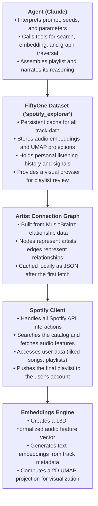

# Spotify AI Playlist Agent

<p align="center">
  
</p>

This project builds a local AI agent that generates Spotify playlists via audio feature embeddings, artist connection graphs (band membership/collaborations via MusicBrainz), and track DNA deep-dives (writers, producers, samples). It then pushes approved playlists to Spotify after visual review in FiftyOne.

## Why We Are Building This

Spotify's playlist and radio algorithms fail in two distinct ways:
1. **Genre-rigid sonic matching**: A track's genre label determines its neighbors, preventing cross-genre discovery even when audio profiles are nearly identical.
2. **No human connection awareness**: Spotify doesn't understand artist networks (band members, side projects, supergroups, collaborations).

Our local AI agent overcomes this by building playlists two ways:
- By **audio feature similarity** across the full catalog (ignoring genre labels).
- By **human artist connection graphs** (traversing real-world membership and collaboration relationships).

## Architecture Overview



## The Role of Voxel51 FiftyOne

Voxel51's open-source tools are central to this project, providing the core data management, visualization, and analysis capabilities.

*   **FiftyOne (Core)**: Acts as the project's central database and visual interface.
    *   **Persistent Cache**: All track metadata, audio features, embeddings, and personal listening history are stored in a FiftyOne dataset. This creates a rich, local source of truth.
    *   **Visual Exploration**: After running `index.py` you can open the FiftyOne App to browse your catalog, inspect sonic clusters, and tag tracks manually.
    *   **Manual Push**: The `push.py` script reads a FiftyOne-tagged selection and creates a Spotify playlist from it — useful when you want to curate by hand rather than via the agent.

*   **FiftyOne Brain**: Provides the machine learning capabilities for visual data exploration.
    *   **Dimensionality Reduction**: The Brain's UMAP implementation is used to generate a 2D embedding for each track from its high-dimensional audio features.
    *   **Visualizing Sonic Clusters**: This 2D embedding powers an interactive scatterplot in the FiftyOne App, where each point is a track. Their proximity visually represents their sonic similarity, allowing you to see the cross-genre clusters the agent discovers.

Together, FiftyOne and the FiftyOne Brain elevate this project from a simple script to a sophisticated, interactive music discovery tool.

## Core MusicBrainz Concepts

To understand how the "Connection" and "Bateman" modes work, it's helpful to know how MusicBrainz organizes music data:

*   **Artist**: An `artist` is a person or a group. It represents the *creator*. For example, "Trent Reznor" is an artist, and "Nine Inch Nails" is also an artist. Artists have relationships to other artists (e.g., "member of band," "collaboration"). `spotaify/core/artist_graph.py` focuses on traversing these artist-to-artist connections.

*   **Recording**: A `recording` is a specific performance of a song that you can listen to. It represents the *sound*. The studio version of "Hurt" is one recording. A live version from a 1995 concert would be a separate recording. Recordings have relationships to artists (e.g., "performer," "composer," "producer") and other recordings (e.g., "samples material from"). `spotaify/core/track_dna.py` focuses on analyzing the credits of a specific recording.

*   **Work**: A `work` is the abstract musical composition itself—the melody and lyrics. The song "Hurt" is a work. Many different recordings can exist for the same work (studio version, live versions, acoustic covers, etc.).

### A Note on Rate Limiting

You will notice `time.sleep(1)` calls in the `spotaify/core/artist_graph.py` and `spotaify/core/track_dna.py` modules. This is intentional. The MusicBrainz API is a free, public service that requires clients to make no more than one request per second. These pauses ensure our agent respects this rate limit and acts as a good citizen of the MusicBrainz ecosystem.

### What If an Artist Isn't on MusicBrainz?

The MusicBrainz database is extensive but not exhaustive. The agent handles missing artists differently depending on the mode:

*   **Connection Mode (`--artist ...`)**: If the main seed artist (e.g., `--artist "My Obscure Garage Band"`) cannot be found in MusicBrainz, the program will stop with a `ValueError`. This is a hard failure because the entire graph traversal depends on this seed.

*   **DNA Mode (`--dna ...`)**: This mode is more resilient. If the primary *recording* can't be found, the process will stop. However, if a person credited on the recording (like a specific producer or session musician) doesn't have their own separate artist page on MusicBrainz, the agent will simply note the credit and continue processing the others. It does not crash.

### How the Agent Thinks: Scoring and Ranking

The `rank_and_select` tool is where the agent makes its final decisions. It scores each candidate track based on a combination of sonic similarity and your personal listening habits. Here's how the score is calculated for each track:

*   **Base Score (Audio Similarity)**: The score starts with the track's `audio_sim` value, which measures how sonically similar it is to your seed tracks or prompt.

*   **Completion Rate Bonus (`+0.3` max)**: The agent rewards tracks you listen to all the way through. A track's score is boosted by its `completion_rate` multiplied by `0.3`. A song you always finish gets a significant bonus.

*   **Skip Rate Penalty (`-0.2` max)**: Conversely, the agent penalizes tracks you frequently skip. A track's score is reduced by its `skip_rate` multiplied by `0.2`. This helps filter out songs you might have saved but don't actually enjoy.

*   **Discovery Boost (`+0.15` flat)**: When discovery is prioritized, the agent gives a flat `+0.15` bonus to any track that is new to you (`is_new_discovery` is true). This encourages the agent to introduce you to new music.

The final list is sorted by this combined score, giving you a playlist that balances sonic relevance, personal taste, and the joy of discovery.

## Developer Notes

### Lazy Loading of API Clients

You will notice that clients like the `SpotifyClient` in `spotaify/agent_tools.py` are not instantiated at the module's top level. Instead, they are initialized inside a helper function (e.g., `_get_spotify_client()`).

```python
# spotaify/agent_tools.py
_spotify: SpotifyClient | None = None # Starts as None

def _get_spotify_client() -> SpotifyClient:
    global _spotify
    if _spotify is None:
        _spotify = SpotifyClient(user_auth=False) # Created on first use
    return _spotify
```

This **lazy-loading** pattern is crucial for testing. It prevents `spotipy` from raising an `OauthError` during `pytest`'s test collection phase, as the client is only created when a tool is actually executed, by which time all necessary mocks are in place.

### Universal Test Setup with `autouse` Fixtures

In test modules like `tests/test_agent_tools.py`, you will see fixtures defined with `@pytest.fixture(autouse=True)`. This tells `pytest` to automatically run that fixture for *every* test in the module without needing to explicitly request it.

This pattern is used for the `mock_deps` fixture to ensure that all external dependencies (like the `SpotifyClient` or `fiftyone_store` functions) are consistently mocked across all tests in the file. It reduces boilerplate and prevents tests from accidentally making real API calls.

### Prompt Engineering with `build_prompt`

The `spotaify/agent.py` script contains a `build_prompt` function that acts as a dedicated "prompt engineer". Its job is to translate the various command-line flags (`--artist`, `--dna`, `--energy`, etc.) into a single, coherent natural language prompt for the AI model.

For example, the command:
`run.bat "industrial rock" --artist "Nine Inch Nails" --connections --energy 0.8-1.0`

...is translated by `build_prompt` into the following instruction for the AI:
`"Connection mode: build a playlist of every artist associated with 'Nine Inch Nails'. Traverse up to depth 2. industrial rock energy between 0.8 and 1.0. Target playlist length: 20 tracks."`

This constructed prompt is what gives the agent its clear starting instructions, guiding its entire tool-use and reasoning process.

## Setup

1.  **Get Your Credentials**

    *   **Spotify**:
        1.  Go to the [Spotify Developer Dashboard](https://developer.spotify.com/dashboard).
        2.  Click `Create app`.
        3.  Note your `Client ID` and `Client Secret`.
        4.  Go to `Edit Settings` and add `http://127.0.0.1:9090` to the "Redirect URIs". This allows spotipy to capture the auth code automatically via a local server — no URL pasting required.

    *   **Anthropic**:
        1.  Go to the [Anthropic Console](https://console.anthropic.com).
        2.  Go to `API Keys` and create a key for this project.

    *   **Genius** (for DNA mode track descriptions and credits):
        1.  Go to [genius.com/api-clients](https://genius.com/api-clients) and create an app.
        2.  Note your `Access Token`.

    *   **MusicBrainz**:
        MusicBrainz does not require an account, but their [API terms](https://musicbrainz.org/doc/MusicBrainz_API/Rate_Limiting) require a real contact email in the user-agent string. Without it, requests are aggressively throttled. Set `MUSICBRAINZ_CONTACT` in your `.env` to your real email address.

    *   **WhoSampled** (optional, for DNA mode sample data):
        Create a free account at [whosampled.com](https://www.whosampled.com). Without credentials the scraper can still find tracks but individual sample pages require login.

    *   **Spotify Data Export** (optional, for personal listening history):
        1.  Go to your Spotify Account Privacy Settings.
        2.  Scroll down to "Download your data" and request your "Extended streaming history".
        3.  When ready (may take several days), copy all the `endsong_*.json` files into `data/history/`.

2.  **Configure Environment**

    Copy the example environment file:
    ```bash
    cp .env.example .env   # Mac/Linux
    copy .env.example .env  # Windows
    ```
    Open `.env` and add the non-sensitive values at minimum:
    ```
    SPOTIFY_CLIENT_ID=...
    SPOTIFY_REDIRECT_URI=http://127.0.0.1:9090
    MUSICBRAINZ_CONTACT=your_real_email@example.com
    WHOSAMPLED_USERNAME=your_whosampled_username   # optional
    ```

    **Recommended — store secrets in the OS keychain** (Windows Credential Manager / macOS Keychain / Linux Secret Service):
    ```bash
    uv run python setup_secrets.py
    ```
    This prompts for each secret (`ANTHROPIC_API_KEY`, `SPOTIFY_CLIENT_SECRET`, `GENIUS_ACCESS_TOKEN`, etc.) and stores them encrypted — nothing written to disk in plain text.

    **Alternative — plain-text `.env`** (simpler, less secure): add secrets directly to `.env`:
    ```
    SPOTIFY_CLIENT_SECRET=...
    ANTHROPIC_API_KEY=...
    GENIUS_ACCESS_TOKEN=...
    WHOSAMPLED_PASSWORD=...   # optional
    HF_TOKEN=...              # optional
    ```
    Both approaches work; the app tries the keychain first and falls back to `.env`.

3.  **Install uv (one-time)**

    [uv](https://docs.astral.sh/uv/) manages Python and all dependencies automatically — no manual `pip install` or virtual environment setup required.

    **Windows:**
    ```powershell
    powershell -ExecutionPolicy Bypass -Command "irm https://astral.sh/uv/install.ps1 | iex"
    ```
    **Mac/Linux:**
    ```bash
    curl -LsSf https://astral.sh/uv/install.sh | sh
    ```

4.  **Authorize Spotify (one-time)**

    The agent creates playlists in your account and requires user-level OAuth. Run this once to open the browser auth flow and cache your token:
    ```bash
    uv run python -c "from spotaify.clients.spotify_client import SpotifyClient; SpotifyClient(user_auth=True)"
    ```
    Approve in the browser. The token is saved to `.spotify_token_cache` and all future runs authenticate silently.

## Usage

### Running the Agent

The simplest way to run spotAIfy is via the included launcher scripts, which handle everything automatically:

**Windows:**
```
run.bat --dna "Niggas in Paris"
run.bat --artist "Nine Inch Nails" --connections --depth 2
run.bat "dark ambient playlist for late night coding" --count 25
```

**Mac/Linux:**
```bash
./run.sh --dna "Play Your Part Pt. 1"
./run.sh --artist "Trent Reznor" --connections --new-only
```

Or run directly with uv from any terminal:
```bash
uv run python -m spotaify.agent --dna "Hurt"
```

On first run, uv automatically creates a virtual environment and installs all dependencies. Subsequent runs start immediately.

---

### Agent Modes

**Sonic Mode** — find tracks by audio similarity:
```bash
run.bat "instrumental post-rock for studying" --count 25
run.bat "upbeat funk" --energy 0.7-1.0 --valence 0.6-1.0
```

**Connection Mode** — map artist relationships via MusicBrainz:
```bash
# Discover every artist connected to Trent Reznor (side projects, bands, collabs)
run.bat --artist "Trent Reznor" --connections --new-only

# Find artists connected to NIN that also match their sound
run.bat --artist "Nine Inch Nails" --connections --match-sound
```

**DNA Mode** — deep-dive a single track's creative DNA:
```bash
run.bat --dna "Hurt"
run.bat --dna "Play Your Part Pt. 1"
```

DNA mode builds a playlist with a **literal musical relationship** to the seed:
- Songs the seed track **directly samples** (the agent resolves the exact source recording on Spotify)
- Songs that **directly sampled** the seed track
- The original recording of any **confirmed melody interpolation** surfaced by Genius or MusicBrainz

No tangential picks — not songs by the same producers, not songs that share a common sample source, not thematic cousins. The agent narrates each connection explicitly ("X samples the break from Y" / "Y was later sampled by X"). Spotify playlist descriptions are kept to ≤300 characters; full narration appears in the terminal.

> **Note**: `--depth` has no effect in DNA mode. It only controls how many hops `traverse_artist_graph` follows in Connection mode.

---

### Index Your Listening History (optional)

To enable personalized ranking (completion rate, skip rate, discovery signals), import your Spotify data export:

```bash
uv run python -m spotaify.core.index --liked --history --resume
```

Place your Spotify `endsong_*.json` export files in `data/history/` before running.

---

### Push a Reviewed Playlist Manually

The agent creates the Spotify playlist automatically at the end of every run. To push a FiftyOne-tagged selection manually:

```bash
uv run python -m spotaify.core.push --name "AI Post-Rock for Studying"
```

## Project Structure

```
spotAIfy/
├── spotaify/                      # Source package
│   ├── agent.py                   # Main AI agent entrypoint with CLI
│   ├── agent_tools.py             # All tools available to the Claude agent
│   ├── config.py                  # Loads credentials & settings from .env
│   ├── clients/
│   │   ├── genius_client.py       # Fetches track descriptions and credits from Genius
│   │   ├── jellyfin_client.py     # Jellyfin media server client
│   │   ├── spotify_client.py      # Wrapper for all Spotify API interactions
│   │   └── whosampled_client.py   # Scrapes WhoSampled for sample relationships (login supported)
│   └── core/
│       ├── artist_graph.py        # MusicBrainz client for artist connection graphs
│       ├── color_mood.py          # Color/mood analysis utilities
│       ├── embeddings.py          # Audio feature normalization and text embeddings
│       ├── frame_extractor.py     # Video frame extraction utilities
│       ├── history_importer.py    # Parses your Spotify data export (JSON files)
│       ├── index.py               # Data pipeline: ingests Spotify data into FiftyOne
│       ├── push.py                # Pushes a manually reviewed FiftyOne selection to Spotify
│       └── track_dna.py           # MusicBrainz client for recording-level credits (DNA mode)
├── tests/                         # Unit and integration tests
├── data/
│   ├── graph/                     # Cached MusicBrainz artist graphs (JSON, auto-created)
│   └── history/                   # Place your Spotify data export files here
├── docs/                          # Design specs and implementation plans
├── pyproject.toml                 # Project metadata and dependencies (uv/pip)
├── run.bat                        # Windows launcher — installs uv if needed, then runs the agent
├── run.sh                         # Mac/Linux launcher
├── requirements.txt               # Legacy pip dependency list
├── setup_secrets.py               # Interactive keychain setup (run once to store API keys securely)
└── .env.example                   # Template for your environment variables
```

## Step-by-Step Implementation Plan

### Task 1: Project Scaffold
**What we are doing**: Setting up the project configuration (`config.py`), dependencies (`requirements.txt`), environment variables (`.env`), and test setup (`pytest`).  
**Why we are doing it**: To establish a solid foundation and ensure all necessary libraries (like `spotipy`, `fiftyone`, `anthropic`, `musicbrainzngs`) are available and tests can be run.

### Task 2: Spotify Client
**What we are doing**: Creating a `SpotifyClient` wrapper to interact with the Spotify API.  
**Why we are doing it**: To search the catalog, fetch audio features, get artist top tracks, and eventually manage user playlists without dealing with raw API requests throughout the app.

### Task 3: History Importer
**What we are doing**: Building a tool to parse Spotify data export JSON files.  
**Why we are doing it**: To calculate personalized listening signals (`play_count`, `completion_rate`, `skip_rate`) so the agent can weight tracks you genuinely finish over those you impulsively skipped.

### Task 4: Embeddings Engine
**What we are doing**: Implementing a 13D normalized audio feature vector, sentence-transformer text embeddings, and a 2D UMAP projection.  
**Why we are doing it**: To encode Spotify's audio features into a format where we can perform similarity searches. This is the core mechanism that breaks genre rigidity and finds tracks with matching sonic profiles.

### Task 5: FiftyOne Store
**What we are doing**: Integrating FiftyOne as our persistent track cache and visual review layer.  
**Why we are doing it**: To store track metadata, embeddings, and listening history locally. It also provides an interactive visual browser to review the AI's proposed playlist before pushing to Spotify.

### Task 6: Artist Graph (MusicBrainz)
**What we are doing**: Connecting to the MusicBrainz API to map artist relationships (members, collaborations, etc.) and traversing this graph.  
**Why we are doing it**: To discover artists via real-world human connections rather than purely sonic similarity, exposing you to supergroups and side projects.

### Task 7: Track DNA (DNA Mode)
**What we are doing**: Digging into a single track's complete creative lineage (writers, producers, session musicians, samples).  
**Why we are doing it**: To build highly specific playlists connected by craft and shared personnel, narrating exactly why each track is included.

### Task 8: Agent Tools
**What we are doing**: Defining 17 tools for our Claude-powered agent (e.g., `search_catalog`, `embed_tracks`, `rank_and_select`, `traverse_artist_graph`, `fetch_genius_info`, `fetch_whosampled`, `resolve_samples`, `create_spotify_playlist`).  
**Why we are doing it**: To give the AI agent the exact capabilities it needs to perform searches, manipulate data, rank tracks, assemble the final playlist, and save it directly to Spotify.

### Task 9: Data Pipeline (`index.py`)
**What we are doing**: Creating a script to ingest liked songs, playlists, recently played tracks, and history exports into the FiftyOne dataset.  
**Why we are doing it**: To populate our local database with your listening habits and Spotify's catalog data so the agent has a rich dataset to work from.

### Task 10: AI Agent (`agent.py`)
**What we are doing**: Implementing the main Claude agent loop that handles user prompts, decides which tools to call, and narrates its reasoning.  
**Why we are doing it**: This is the brain of the project. It orchestrates the Sonic, Connection, and DNA modes based on your natural language requests.

### Task 11: Push to Spotify (`push.py`)
**What we are doing**: Writing a script to read the tagged tracks from FiftyOne and create a real playlist in your Spotify account.  
**Why we are doing it**: To finalize the process, turning the agent's proposed tracks into an actual playlist you can listen to on Spotify.
